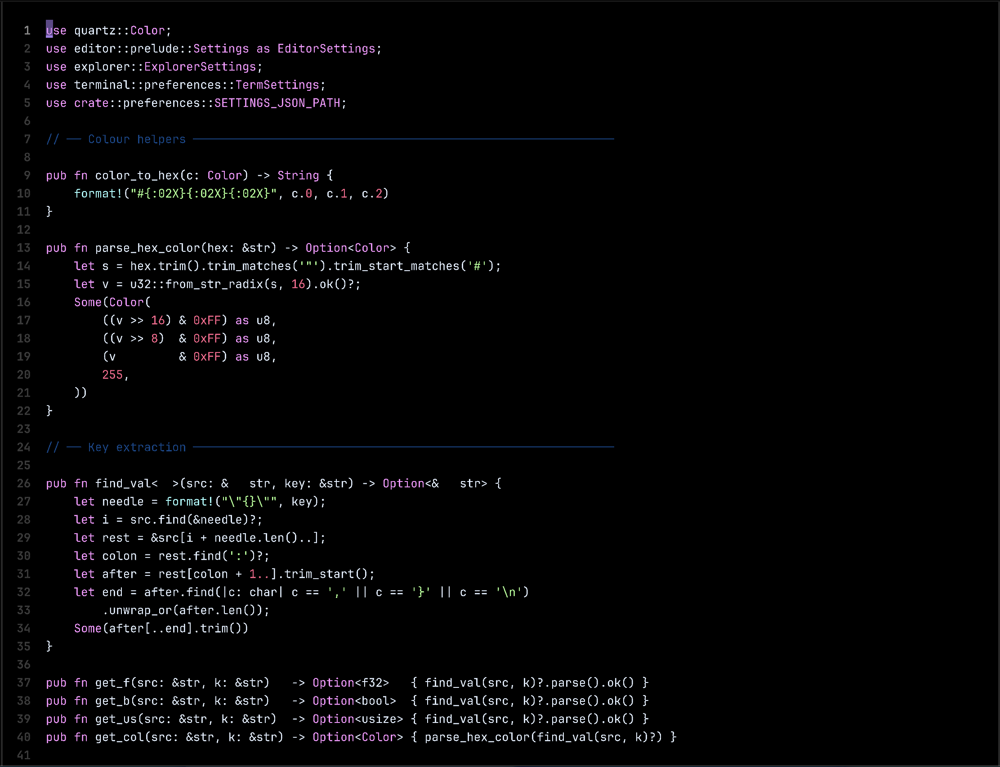

# Editor

<p align="center">
  
</p>

<p align="center">
  A reusable code editor component for Quartz projects. Drop it into any canvas, point it at a file, and get syntax highlighting, a blinking cursor, click-to-position, keyboard editing, selection, scroll physics, and autosave — out of the box.
</p>

---

## What it is

Editor is a self-contained Quartz component. It manages its own GameObjects, registers its own input callbacks, and runs its own update loop — all scoped to a named id prefix so multiple instances can coexist on the same canvas without conflict.

It handles two modes automatically based on file extension: **text mode** for source files (with Rust syntax highlighting) and **image viewer mode** for png, jpg, gif, webp, and other image formats.

---

## Usage

```rust
use editor::{Editor, Settings, CursorStyle};

// Load fonts and theme bytes from your asset pipeline
let code_font   = Arc::new(Font::from_bytes(&assets.get_font("JetBrainsMono-Regular.ttf")?)?);
let gutter_font = Arc::new(Font::from_bytes(&assets.get_font("JetBrainsMono-Bold.ttf")?)?);
let theme_bytes = assets.get_file("cobalt.tmTheme").unwrap_or_default();

let settings = Settings::default();

let mut ed = Editor::new(
    x, y, w, h,
    code_font,
    gutter_font,
    "/path/to/file.rs".to_string(),
    theme_bytes,
    settings,
);

// Mount objects and wire up callbacks
ed.mount(cv);
ed.register_callbacks(cv);
```

For multiple editors on the same canvas, use `with_id` to give each instance a unique prefix:

```rust
let ed = Editor::with_id("main_editor", x, y, w, h, ...);
```

---

## Resizing

Call `set_bounds` any time the panel dimensions change — typically from your layout update loop:

```rust
ed.set_bounds(panels.editor.0, panels.editor.1, panels.editor.2, panels.editor.3);
```

The editor reads its live bounds each tick, so clip regions, background fills, and text layout all update automatically.

---

## Opening files

```rust
ed.open_file("/path/to/other_file.rs");
```

If the current file has unsaved changes it is saved first. The editor resets scroll position and cursor state for the new file, and switches between text and image viewer mode based on the file extension.

---

## Settings

`Settings` controls typography, scrolling behaviour, cursor style, and editing features. All fields have sensible defaults.

```rust
let settings = Settings {
    font_size:       13.0,
    line_height_mul: 1.55,   // line_height = font_size * mul
    char_width_mul:  0.601,  // char_width  = font_size * mul
    cursor_style:    CursorStyle::Underline,
    cursor_blink:    true,
    auto_pairs:      true,   // insert matching close bracket / quote
    scroll_accel:    5.5,
    scroll_friction: 0.10,
    ..Default::default()
};

// Apply at any time — takes effect on the next tick
ed.apply_settings(settings);
```

Three cursor styles are available: `Line` (2px vertical bar), `Block` (full character cell), and `Underline` (3px bar at the baseline).

---

## Themes

Pass any `.tmTheme` file as bytes. The editor parses scope rules and maps them to its internal colour slots — keyword, control flow, type, string, number, comment, macro, and lifetime — with a fallback to a plain default colour for anything unrecognised.

```rust
// Swap theme at runtime
ed.reload_theme(new_theme_bytes);
```

---

## Keyboard support

| Key | Action |
|-----|--------|
| Character keys | Insert character; auto-close brackets and quotes |
| Enter | Newline with auto-indent; opens extra indented line between matching pairs |
| Backspace / Delete | Delete character; remove both chars when between a matching pair |
| Tab | Insert 4 spaces |
| Arrow keys | Move cursor; hold Shift to extend selection |
| Home / End | Jump to line start / end; hold Shift to extend selection |
| Ctrl+S | Save |
| Ctrl+A | Select all |
| Ctrl+/ | Toggle `//` line comment |
| Ctrl+Home / End | Jump to first / last line |

---

## Autosave

The editor autosaves dirty files on a configurable interval. Saves also trigger on `Ctrl+S` and before `open_file` switches to a new file.

---

## Image viewer

Files with image extensions (png, jpg, jpeg, gif, bmp, webp, tiff, ico) open in image viewer mode automatically. The source text objects are hidden and a single image GameObject is shown instead. Switching back to a text file restores the editor.

---

## Architecture

Editor follows the same objects / logic split as the rest of the Quartz ecosystem.

`mount(cv)` constructs all GameObjects — background, gutter, code text, selection overlays, cursor, and the image viewer sprite — and adds them to the canvas. No logic runs here.

`register_callbacks(cv)` wires up mouse and keyboard input handlers plus the single `on_update` tick that drives scroll physics, slice rendering, selection overlay positioning, cursor blinking, and autosave.

All mutable state lives in `Shared<T>` values on the `Editor` struct. There are no canvas variables — the editor is entirely self-contained.
